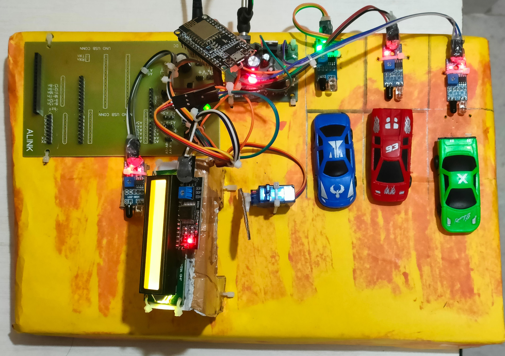

# 🚗 Smart Car Parking System using NodeMCU (ESP8266)

A real-time smart parking system using **NodeMCU**, **IR sensors**, and **servo motors**. Designed to detect vehicle presence and automate barrier control while displaying available parking slots on an LCD.

---

## 🔧 Tools & Technologies
- NodeMCU ESP8266
- IR Proximity Sensors
- Servo Motor
- LCD Display (16x2)
- Arduino IDE
- C/C++
- Breadboard, Resistors, Jumper Wires

---

## 🧩 Features
- 🚘 Real-time detection of parked vehicles
- ⚙️ Automated control of entry/exit barrier using servo
- 📺 Slot availability displayed on LCD
- ⚡ Fast and low-cost implementation
- 🧠 Expandable for IoT/cloud-based monitoring

---

## 🖼️ Hardware Diagram

---

## 📈 Skills Demonstrated
- Embedded C Programming
- NodeMCU (ESP8266) Development
- IR Sensor Integration
- Servo Motor Control
- LCD Display Programming
- Smart Automation Design
- Real-time Hardware Interfacing

---

##Author
 **Harshitha Adicherla**  

---

## 📬 Contact
🔗 [LinkedIn](https://www.linkedin.com/in/harshithaadicherla10)  
📧 harshithaadicherla03@gmail.com
